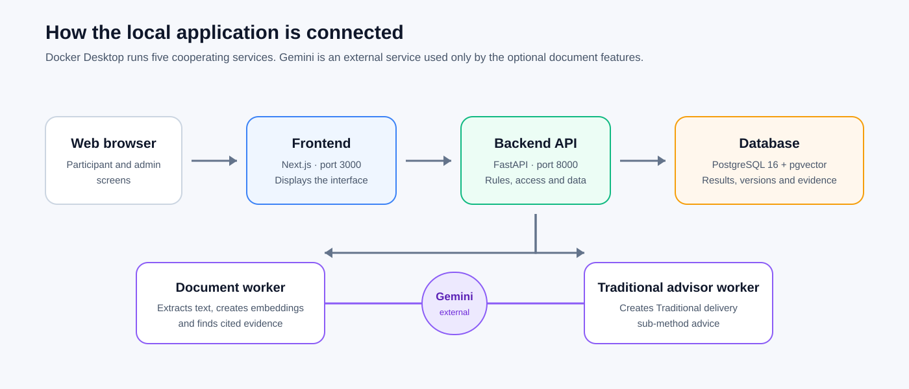
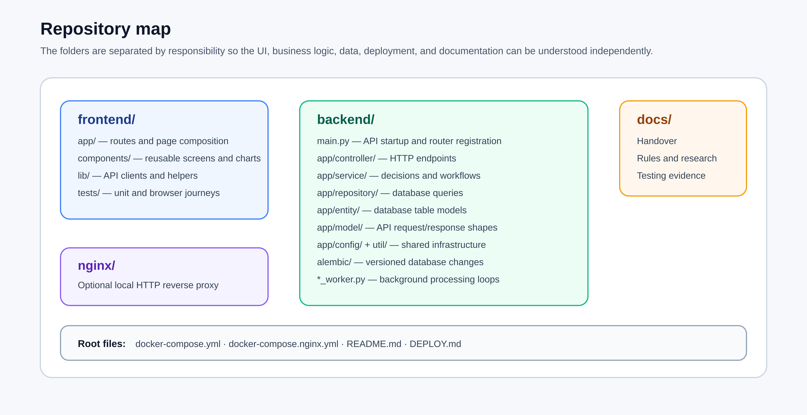
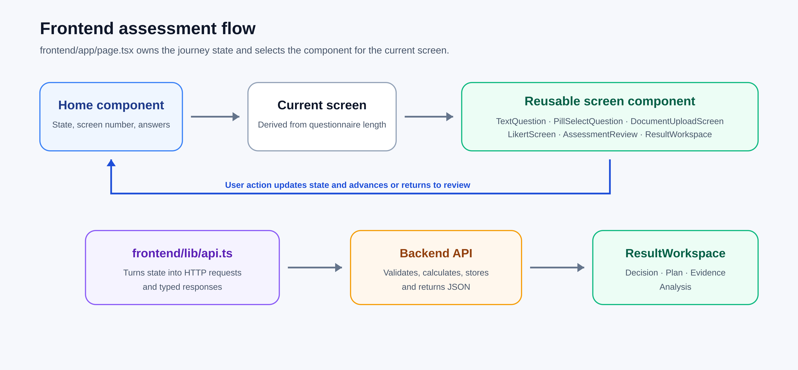
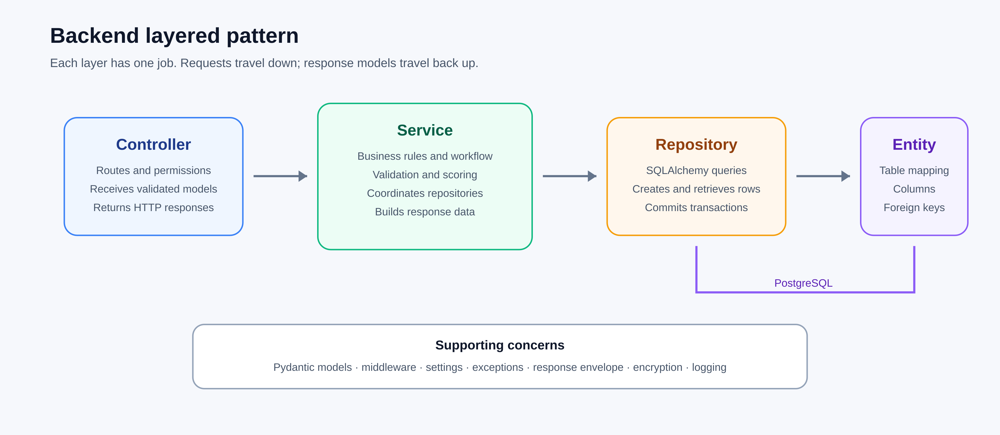
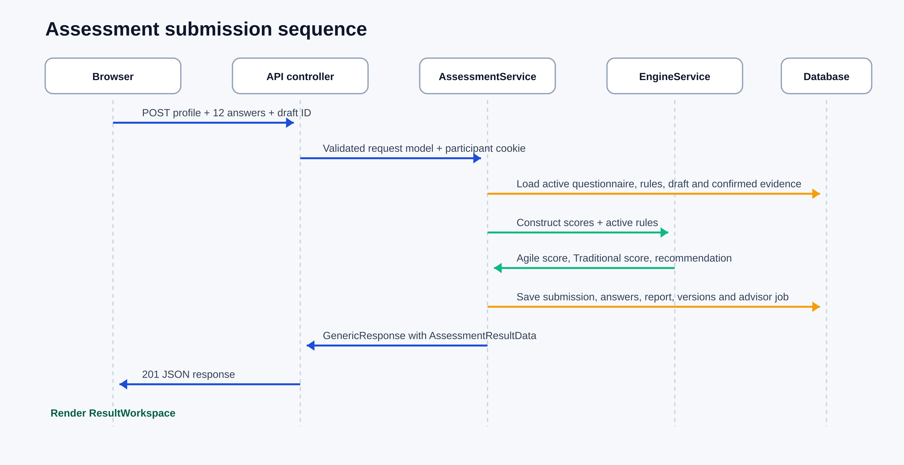
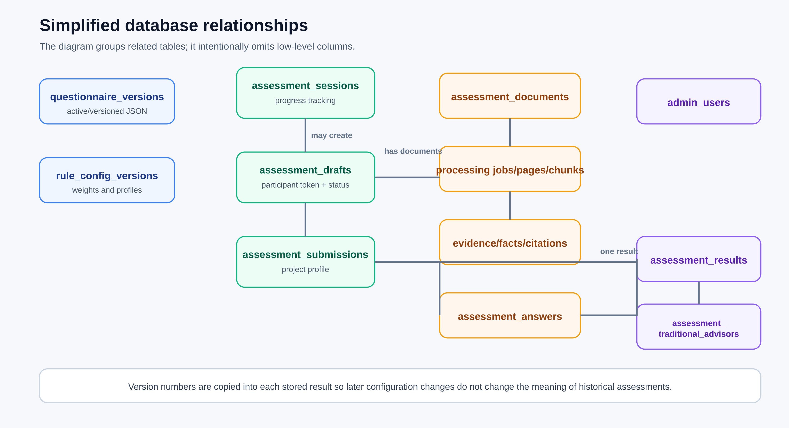
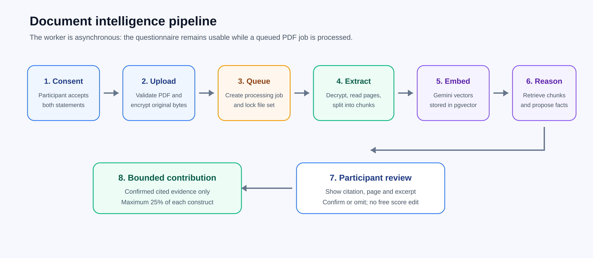
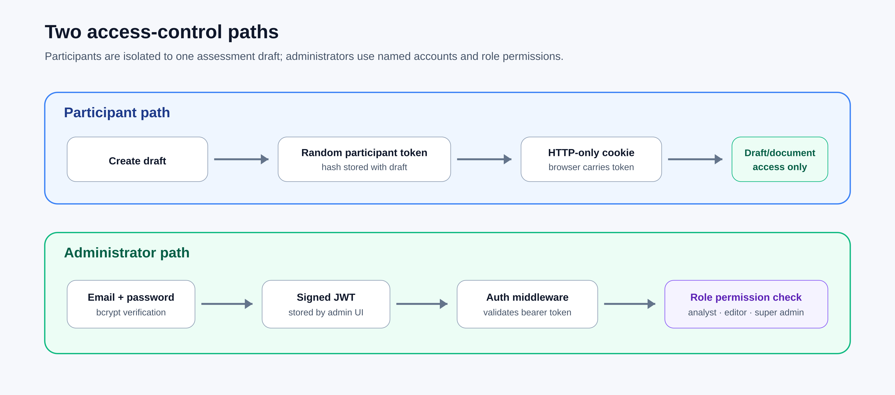

# MethodAlign IS Codebase And Application Handover

Version 1.1 — 28 August 2026<br>
Code baseline: `6f449c9`

This is the main repository-based handover guide for MethodAlign IS. It is written for a client or student with limited technical experience. It first explains how the code works and then identifies the operating and maintenance references.

> MethodAlign IS is an explainable, rule-based decision-support prototype. It compares project answers with configured Agile and Traditional reference profiles. The recommendation supports human judgment; it does not guarantee project success.

## 1. The System In One Minute

The application is a conversation between five parts:

1. The browser displays questions, document controls, results, and administrator screens.
2. The Next.js frontend collects input and sends API requests.
3. The FastAPI backend validates requests, applies permissions, coordinates workflows, and calculates the recommendation.
4. PostgreSQL stores users, configurations, assessments, results, document records, and semantic-search vectors.
5. Two background workers perform optional document analysis and Traditional sub-method advice without delaying normal web requests.



The core Agile-versus-Traditional recommendation is deterministic. Gemini is limited to optional document evidence and Traditional delivery-method advice.

## 2. Technology Stack

| Technology | Location | Plain-language purpose |
| --- | --- | --- |
| Next.js, React, and TypeScript | `frontend/` | Builds participant and administrator screens. TypeScript checks many data-shape mistakes before runtime. |
| Tailwind CSS | Frontend components | Supplies the visual styling through utility class names. |
| FastAPI and Python | `backend/` | Receives requests, validates input, enforces access, runs workflows, and returns JSON. |
| SQLAlchemy and Alembic | Backend data layer | Map Python objects to database tables and apply versioned schema changes. |
| PostgreSQL and pgvector | `db` container | Store application records and document-search vectors. |
| Google Gemini | Optional worker workflows | Creates embeddings, cited evidence suggestions, and Traditional advice. |
| Docker Compose | Repository root | Starts the complete local system as five connected services. |
| Pytest, Vitest, and Playwright | Test directories | Check backend logic, UI units, and complete browser journeys. |

## 3. Repository Map



| Location | Responsibility | Open it when… |
| --- | --- | --- |
| `frontend/app/page.tsx` | Participant journey, page state, submission, and screen selection | Changing the public assessment flow |
| `frontend/app/admin/page.tsx` | Main administrator route and workspace state | Changing the admin entry experience |
| `frontend/components/` | Questions, document workflow, results, charts, and admin panels | Changing what a screen displays |
| `frontend/lib/api.ts` | Participant API calls and response types | Tracing a participant request |
| `frontend/lib/adminApi.ts` | Authenticated administrator API calls | Tracing an administrator request |
| `backend/main.py` | API startup, middleware, routers, health, and default-admin seed | Understanding how the API is assembled |
| `backend/app/controller/` | HTTP endpoints and request/response handling | Finding which URL receives a request |
| `backend/app/service/` | Business decisions and multi-step workflows | Changing how a feature behaves |
| `backend/app/repository/` | Database queries and persistence | Changing how records are found or stored |
| `backend/app/entity/` | SQLAlchemy database table definitions | Understanding stored data |
| `backend/app/model/` | Validated API request and response shapes | Changing accepted or returned data |
| `backend/alembic/` | Ordered database migrations | Changing the database schema safely |
| `backend/*_worker.py` | Background polling processes | Tracing document or advisor jobs |
| `docker-compose.yml` | Five-service local runtime | Starting or diagnosing the complete stack |
| `docs/` | Handover, research, calculation, testing, and admin references | Understanding design rationale or operation |

### Common Code Terms

| Term | Meaning |
| --- | --- |
| Component | A reusable piece of a screen, such as a question card or chart |
| Controller or route | The reception desk for one web address |
| Service | The coordinator that applies rules and decides what must happen |
| Repository | The database clerk that saves or retrieves records |
| Entity | A Python description of a database table |
| Model | A contract describing acceptable request or response data |
| Worker | A separate process that handles queued work in the background |

## 4. How A Request Moves Through The System

1. A person clicks a control in the browser.
2. React updates the visible screen or calls a function in `frontend/lib/`.
3. The frontend sends an HTTP request to an `/api/v1` address.
4. A FastAPI controller validates the request shape and delegates to a service.
5. The service applies the workflow and business rules.
6. A repository reads or writes SQLAlchemy entities in PostgreSQL.
7. The backend returns a standard JSON response envelope.
8. The frontend converts the response into the next screen, result, or error message.

A useful tracing example is:

```text
frontend/app/page.tsx
  → frontend/lib/api.ts
  → backend/app/controller/assessment_controller.py
  → backend/app/service/assessment_service.py
  → backend/app/service/engine_service.py
  → backend/app/repository/assessment_repository.py
  → backend/app/entity/assessment_entity.py
```

## 5. Frontend Explanation

The frontend is one Next.js application with two main experiences:

- `/` is the public participant assessment.
- `/admin` is the administrator workspace.

React components render the interface. Page state records the current answers and journey position. Functions in `frontend/lib/` communicate with the API. The frontend displays results but does not own the authoritative scoring formula.



### Participant Journey

`frontend/app/page.tsx` coordinates the public flow. Its current screen and loaded questionnaire determine whether the participant sees:

- the landing page;
- ten project-context questions;
- optional document consent/upload/review;
- twelve methodology questions;
- the final review;
- calculation progress; or
- the result workspace.

Shortened submission example:

```tsx
// frontend/app/page.tsx
const response = await createAssessment({
  profile: { ...projectContext },
  answers: questionnaire.likert_questions.map((question) => ({
    question_key: question.question_id,
    construct: question.construct,
    value: resolvedAnswers[question.question_id]!,
  })),
  draft_id: resolvedDraftId,
  session_id: assessmentSessionId,
});

setState((previous) => ({
  ...previous,
  result: response,
  submitting: false,
}));
```

This code collects the project profile and one score for every active methodology question. It asks the backend to create the assessment, then stores the returned result in React state so the result workspace appears.

### Frontend API Boundary

```tsx
// frontend/lib/api.ts — shortened
export async function createAssessment(payload) {
  const response = await fetch(
    `${API_BASE_URL}/api/v1/assessments`,
    {
      method: "POST",
      credentials: "include",
      headers: { "Content-Type": "application/json" },
      body: JSON.stringify(payload),
    },
  );

  const envelope = await response.json();
  if (!response.ok || !envelope.success) {
    throw new Error(envelope.message);
  }
  return envelope.data;
}
```

`credentials: "include"` sends the participant assessment cookie. Administrator calls use `frontend/lib/adminApi.ts`, which adds the administrator bearer token.

Other important frontend locations:

- `frontend/components/results/` renders scores, drivers, risks, comparisons, evidence, and Traditional advice.
- `frontend/components/admin/` renders overview, assessments, rules, questionnaires, and users.
- `frontend/lib/resultAnalytics.ts` derives display-friendly chart values from stored results.
- `frontend/lib/textValidation.ts` centralizes meaningful-text validation.
- `frontend/tests/` contains component tests and full Playwright browser journeys.

## 6. Backend Layering

The backend separates web transport, business behavior, and storage. Controllers should stay small, services should explain the workflow, and repositories should contain database access.



### Startup

`backend/main.py` loads settings, configures CORS, registers the four route groups, adds request/authentication middleware, installs error handlers, exposes `/health`, and seeds the default local administrator.

```python
# backend/main.py — shortened
app = FastAPI(title=settings.app_name, version="0.1.0")

app.include_router(
    assessment_controller.router,
    prefix="/api/v1/assessments",
)
app.include_router(
    draft_controller.router,
    prefix="/api/v1/assessment-drafts",
)
app.include_router(
    questionnaire_controller.router,
    prefix="/api/v1/questionnaire",
)
app.include_router(
    admin_controller.router,
    prefix="/api/v1/admin",
)
```

### Main Endpoint Families

| Prefix | Purpose |
| --- | --- |
| `/api/v1/questionnaire` | Read the active participant questionnaire |
| `/api/v1/assessment-drafts` | Create a private draft, capture consent, upload/process PDFs, and review evidence |
| `/api/v1/assessments` | Track progress, submit, retrieve results, and retrieve/retry Traditional advice |
| `/api/v1/admin` | Login, analytics, submissions, exports, versions, documents, deletion, and users |

### Controller To Service Example

```python
# backend/app/controller/assessment_controller.py — shortened
@router.post(
    "",
    response_model=GenericResponse[AssessmentResultData],
    status_code=201,
)
def create_assessment(payload, request, response, db=Depends(get_db)):
    service_response = assessment_service.create_assessment(
        db=db,
        payload=payload,
        participant_token=request.cookies.get(
            settings.participant_cookie_name
        ),
    )
    return apply_status_code(
        response=response,
        payload=service_response,
    )
```

FastAPI validates the request model. The controller obtains the database session and participant cookie, then delegates. `AssessmentService` owns the complete workflow. Repositories and entities persist the result. `GenericResponse` gives the frontend a predictable response format.

When adding functionality, place:

- a new URL in a controller;
- the behavior and decisions in a service;
- database access in a repository;
- stored fields in an entity and Alembic migration; and
- input/output contracts in a model.

## 7. Assessment And Scoring Flow

`AssessmentService` is the central assessment coordinator. If a database error occurs, its transaction is rolled back so the application does not retain a half-created result.



The service:

1. confirms answers exist and resolves the participant-owned draft;
2. loads the active questionnaire and rules, or the snapshots frozen into the draft;
3. validates all methodology answers and “Other” profile text;
4. creates the submission and raw answer records;
5. computes questionnaire construct averages;
6. blends only eligible participant-confirmed document evidence;
7. calls `EngineService` for the deterministic comparison;
8. creates dependent scores, drivers, risks, rationale, confidence, and next steps;
9. stores the result and configuration version numbers; and
10. queues optional advice when the main recommendation is Traditional.

### Scoring Engine

The twelve methodology questions become three averages:

| Construct | Questions | Active provisional weight | Nominal influence |
| --- | --- | ---: | ---: |
| Flexibility | Q11–Q14 | 1.37 | 45.64% |
| Performance | Q15–Q17 | 0.64 | 21.35% |
| Strictness | Q18–Q22 | 0.99 | 33.01% |

Shortened calculation:

```python
# backend/app/service/engine_service.py
weighted = {
    key: construct_scores[key] * rules.construct_weights[key]
    for key in construct_scores
}

agile_gap = sum(
    abs(
        weighted[key]
        - rules.agile_baseline[key] * rules.construct_weights[key]
    )
    for key in weighted
)

traditional_gap = sum(
    abs(
        weighted[key]
        - rules.traditional_baseline[key]
        * rules.construct_weights[key]
    )
    for key in weighted
)

agile_score = max(0, 100 - (agile_gap / gap_scale) * 100)
traditional_score = max(
    0,
    100 - (traditional_gap / gap_scale) * 100,
)

recommendation = (
    "Agile"
    if agile_score >= traditional_score
    else "Traditional"
)
```

Each Agile and Traditional baseline is a configured three-construct reference profile. A smaller weighted gap becomes a higher 0–100 compatibility score. The higher score wins; a tie currently resolves to Agile. A strictness override exists in code but is disabled in the active Version 2 rules.

| Score gap | Confidence label | Correct interpretation |
| --- | --- | --- |
| 20 or more | High | The configured profiles are clearly separated |
| 10 to below 20 | Moderate | One profile is stronger, but review remains useful |
| Below 10 | Close | The decision is narrow and needs careful human review |

Confidence is separation between the two scores. It is not a probability, confidence interval, or guarantee.

## 8. Database And Version History

PostgreSQL is the system of record. SQLAlchemy entity classes describe tables, repository classes perform queries, and Alembic migrations record schema changes. pgvector supports semantic document retrieval.



| Data group | Representative records | Purpose |
| --- | --- | --- |
| Configuration | Questionnaire and rule versions | Editable, activatable questions and scoring configuration |
| Participant progress | Sessions and assessment drafts | Journey progress and an assessment-scoped private workspace |
| Final assessment | Submissions, answers, and results | Project context, raw scores, and the decision brief |
| Document intelligence | Documents, jobs, pages, chunks, evidence, citations, facts, and agent runs | Encrypted files, retrieval, review, and audit trace |
| Traditional advisor | Advisor and job records | Optional queued advice and status |
| Administration | Admin users | Named accounts, password hashes, roles, and active status |

A draft captures the questionnaire and rule versions used when it begins. A final result records those version numbers. Activating a new configuration therefore does not rewrite or silently reinterpret historical assessments.

> Do not change a deployed table only by editing an entity class. Add a reviewed Alembic migration, test it against a backup copy, and run the matching tests.

## 9. Document Intelligence And Gemini Boundaries

Document intelligence is an optional retrieval-augmented generation workflow. The system first finds relevant PDF passages and then asks Gemini to reason from those passages. The participant sees the citation and must explicitly confirm or omit a suggestion before it can affect scoring.



The stages are:

1. Validate consent, PDF type, count, size, duplicate hash, and selectable text.
2. Encrypt the original PDF bytes and store document metadata.
3. Create a processing job and return control to the browser.
4. Let the document worker decrypt, read pages, and create chunks.
5. Ask Gemini for embeddings and store the vectors in pgvector.
6. Retrieve relevant chunks and propose controlled facts with citations.
7. Validate response structure and citation linkage.
8. Let the participant confirm or omit each suggestion.
9. Limit confirmed document evidence to at most 25% of a construct.

The worker is separate from the API because PDF and provider calls can be slow or rate-limited:

```python
# backend/document_worker.py — simplified
while True:
    db = SessionLocal()
    try:
        processed = service.process_next_job(db)
    finally:
        db.close()

    if not processed:
        time.sleep(settings.document_worker_poll_seconds)
```

The Traditional advisor is another queued workflow. It runs only after the deterministic engine has selected Traditional. Gemini cannot change the main recommendation.

| Uses Gemini | Does not use Gemini |
| --- | --- |
| PDF embeddings and cited evidence suggestions | Core construct averages |
| Traditional sub-method advice after a Traditional result | Agile/Traditional compatibility calculation |
| Natural-language reasoning from bounded context | Final recommendation class selection |

## 10. Authentication And Data Protection

Participants and administrators use different access paths.



- A participant receives a random token in an HTTP-only browser cookie. Only its hash is stored, and it limits access to one draft and its documents.
- An administrator logs in with a named account. The backend verifies a signed JWT and applies role permissions.

Shortened middleware behavior:

```python
# backend/app/config/middleware.py
if _is_whitelisted(request.url.path):
    return await call_next(request)

auth_header = request.headers.get("Authorization", "")
if not auth_header.startswith("Bearer "):
    return JSONResponse(status_code=401, content={...})

payload = jwt.decode(
    token,
    settings.jwt_secret,
    algorithms=[settings.jwt_algorithm],
)
request.state.user_subject = payload.get("sub")
```

`backend/app/config/auth_config.py` performs the role checks for viewing, editing, activation, deletion, exports, and user management.

| Control | Implementation and owner responsibility |
| --- | --- |
| Passwords | Stored as bcrypt hashes; replace and deactivate the seeded local administrator |
| Admin sessions | Signed bearer tokens with configured expiry and permissions |
| Participant isolation | Assessment-specific token and HTTP-only cookie |
| Documents | AES-GCM encryption at rest |
| Secrets | Store JWT, encryption, and Gemini values only in ignored environment files and a separate secret backup |
| External AI | Use only after explicit consent and owner approval of provider/data requirements |
| Network | Do not expose the delivered HTTP localhost stack directly to the public internet |

## 11. Docker Runtime

`docker-compose.yml` builds and connects five services:

| Container | Starts from | Depends on | Persistent data |
| --- | --- | --- | --- |
| `db` | `pgvector/pgvector:pg16` | None | `postgres_data` volume |
| `backend` | `backend/Dockerfile` | Healthy database | `assessment_documents` volume |
| `document-worker` | Backend image and `document_worker.py` | Healthy backend | Shared document volume |
| `traditional-advisor-worker` | Backend image and `traditional_advisor_worker.py` | Healthy backend | Shared document volume |
| `frontend` | `frontend/Dockerfile` | Healthy backend | No application data volume |

The database and document volume survive normal stops and restarts. `docker compose down -v` deletes both volumes and must not be used as a routine stop command.

## 12. Where To Make Common Changes

| Requested change | Start here | Also check |
| --- | --- | --- |
| Question wording or anchors | Admin Questionnaire screen and questionnaire service | Version activation, UI rendering, tests |
| Scoring weights or profiles | Admin Rules screen and rule service | Engine tests, preview, research reference |
| Scoring formula | `backend/app/service/engine_service.py` | Assessment service, rule model, calculation reference |
| Participant screen | `frontend/app/page.tsx` and `frontend/components/` | API client and browser tests |
| Administrator screen | `frontend/app/admin/` and `frontend/components/admin/` | Admin API client and permission tests |
| New API behavior | Backend controller, then service | Model, repository/entity, tests, frontend client |
| Stored field or table | Backend entity and Alembic migration | Repository, backup/restore, tests |
| PDF evidence behavior | `document_intelligence_service.py` | Worker, entities, Gemini client, RAG tests |
| Traditional advice | `traditional_advisor_service.py` | Worker, controlled catalogue, validation tests |
| Ports or services | `docker-compose.yml` and `DEPLOY.md` | Health checks, secrets, frontend API URL |

Safe change sequence:

1. Trace the existing user-visible behavior through the owning files.
2. Record the current commit and back up data before configuration or schema work.
3. Make the smallest change in the correct layer.
4. Add an Alembic migration for schema changes.
5. Run focused tests and the complete affected browser journey.
6. Rebuild containers when dependencies or compiled frontend code change.
7. Verify health, logs, a synthetic participant case, administrator access, and historical results.
8. Update the relevant documentation.

## 13. Daily Operation

Start Docker Desktop, open PowerShell in the repository, and run:

```powershell
docker compose up -d
docker compose ps
```

Open:

- Participant assessment: <http://localhost:3000>
- Administrator workspace: <http://localhost:3000/admin>
- Backend health: <http://localhost:8000/health>
- Interactive API reference: <http://localhost:8000/docs>

Stop safely while preserving data:

```powershell
docker compose stop
```

For environment setup, backup, recovery, logs, troubleshooting, and the optional Nginx entry point, use [DEPLOY.md](../DEPLOY.md).

For every administrator screen and control, use [Admin Dashboard Guide](admin-dashboard-guide.md).

For exact formulas and rules, use [Rule And Calculation Reference](rule-and-calculation-reference.md).

For quality checks and known test coverage, use [Quality Assurance Plan](testing/quality-assurance-plan.md) and [Test Execution Report](testing/test-execution-report.md).

## 14. Presentation Questions And Answers

| Client question | Short answer |
| --- | --- |
| Where is the main decision made? | `backend/app/service/engine_service.py`; `AssessmentService` prepares and stores its inputs and outputs. |
| Does AI choose Agile or Traditional? | No. The core recommendation is deterministic and rule-based. |
| Can future rule changes alter old results? | No. Results record their rule/questionnaire versions and are not automatically recalculated. |
| Why are there two workers? | PDF analysis and Traditional advice can be slow or rate-limited, so they run outside the API request. |
| Where is client data stored? | PostgreSQL and the encrypted document Docker volume; matching secrets are required for recovery. |
| What should a new developer read first? | `README.md`, this guide, then trace one feature using the repository map. |

Suggested technical explanation:

> MethodAlign uses a React/Next.js frontend and a Python FastAPI backend. Requests enter thin controllers, services own workflows and deterministic scoring, repositories store SQLAlchemy entities in PostgreSQL, and version records preserve historical meaning. Optional Gemini features run in two background workers: one produces cited PDF evidence for participant confirmation, and one adds Traditional sub-method advice after—never before—the rule engine decides the main result.

## 15. Handover Checklist

- [ ] The client can identify `frontend/`, `backend/`, `docs/`, and `docker-compose.yml`.
- [ ] The client can trace an assessment from `frontend/app/page.tsx` to `EngineService` and the database entities.
- [ ] The client understands that Gemini does not choose the main recommendation.
- [ ] The client can start, check, and safely stop all five services.
- [ ] The default administrator has been replaced for important data.
- [ ] Environment secrets were transferred separately from source code.
- [ ] Database, encrypted documents, and the matching encryption key are backed up together.
- [ ] A synthetic assessment and administrator login have been verified.
- [ ] The client understands that the result supports rather than replaces professional judgment.
